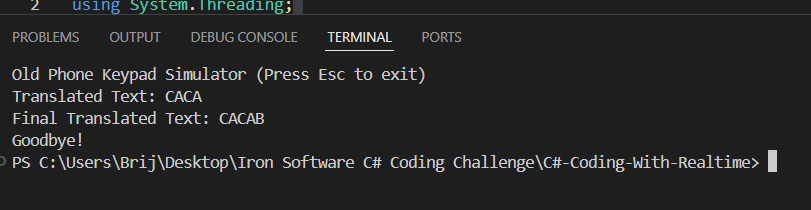

# Old Phone Keypad Simulator

This is a C# console application that simulates typing on an old phone keypad. In which, the system takes input as a numeric sequence and returns an output of alphabetic string.

## Getting Started

### Prerequisites

- [.NET SDK](https://dotnet.microsoft.com/download)

### Building and Running

1. Used Visual Studio Code to build and run the assignment.
2. Open a terminal and navigate to the project directory.
3. Build the project:

```sh
    dotnet build
```

4. Run the project:

```sh
    dotnet run
```

### Usage Code1 and Code2

The program will prompt you to enter a sequence of numbers. Use the old phone keypad logic to enter letters:

- Each number corresponds to a set of letters (e.g., 2 -> A, B, C).
- Press a number multiple times to cycle through the letters.
- Use `*` for backspace.
- Use `#` to send (it doesn't affect the output).

## Difference between Code1 and Code2

### Code1 (C#-Coding)

-Rather than just using specific input, user input was used to get various outputs, which made it more user-friendly.
-You can enter multiple sequences in a single run. Press Enter on an empty line to exit.


### Code2 (C#-Coding-RealTime)

-Adding more functionality to the above solution, the second code can completely mimic the actual representation of the old phone keypad, as it can give the result in real-time.
-Once we run the code and start typing numeric characters, it directly gives appropriate answers.


Issue: The second code is more complex and slow and I am still figuring out how to resolve '\*' and 'backspace'.
